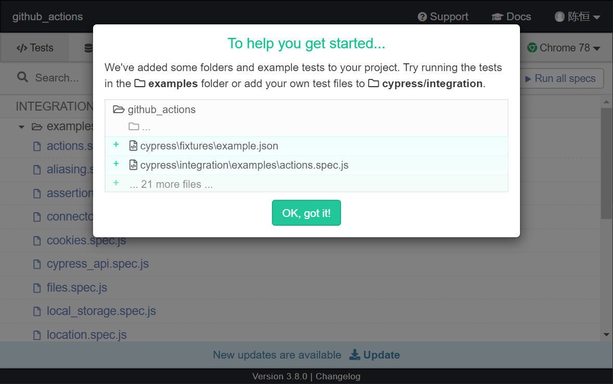
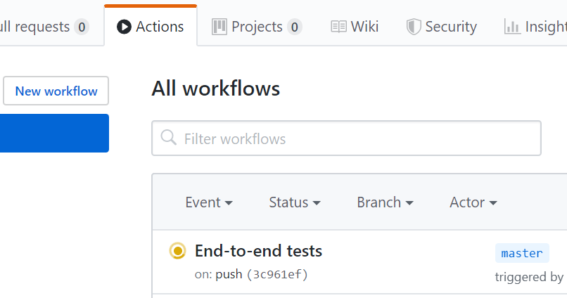
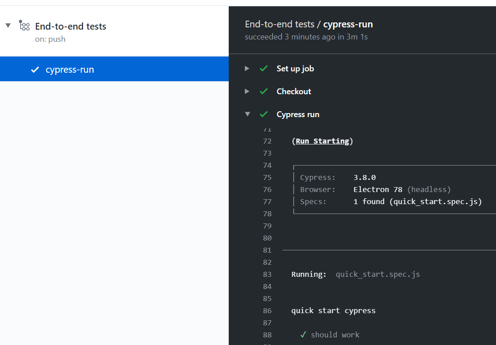
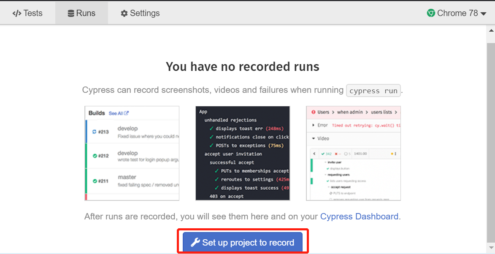
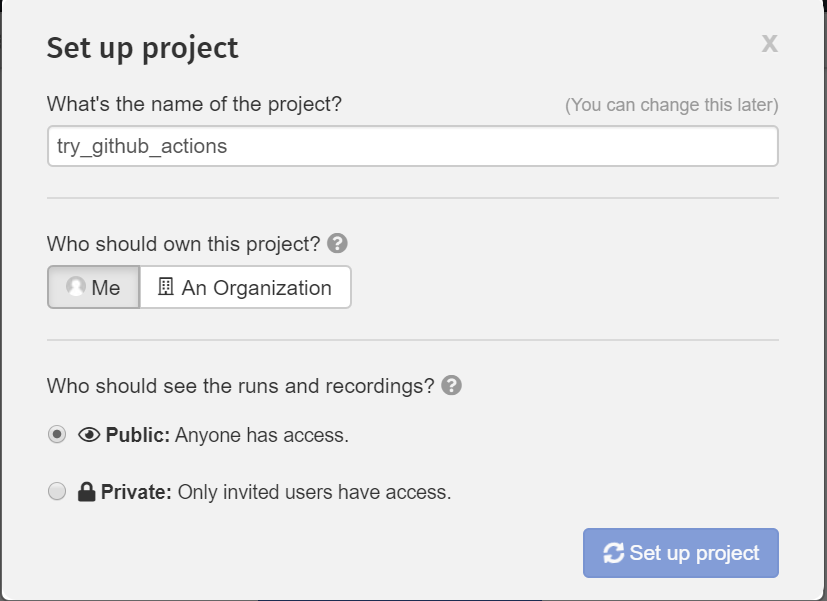
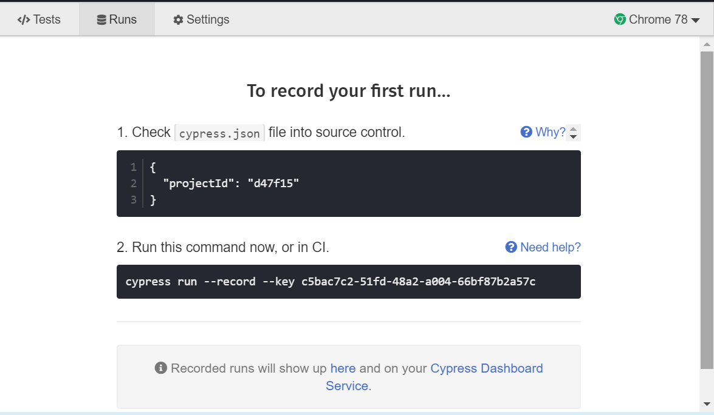
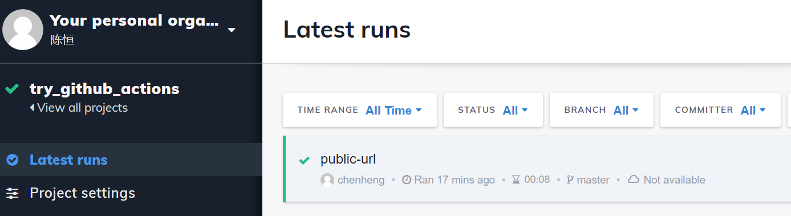

# cypress 并不最佳实践

## 安装和运行

直接 `yarn` 安装即可

```
yarn add cypress start-server-and-test -D
```

然后加入到 `npm script` 中, `npm script` 如下

```json
{
  "scripts": {
    "start": "parcel index.html",
    "build": "parcel build index.html",
    "cy:open": "cypress open",
    "cy:run": "cypress run",
    "dev": "start-server-and-test start http-get://localhost:1234 cy:open"
  }
}
```
运行 `yarn dev` 后开发服务器会运行，然后 `cypress` 窗口会打开，项目目录会多一个 `cypress` 文件夹

```
cypress
├── fixtures						// mock 数据文件
│   └── example.json
├── integration 					// 示例测试文件
│   └── examples
│       ├── actions.spec.js
│       ├── aliasing.spec.js
│       ├── assertions.spec.js
│       ├── ...	
├── plugins 						// 定义一些初始化设置跟变量
│   └── index.js
└── support							// 可以抽取一些公共的方法作为我们的私有命令
    ├── commands.js
    └── index.js
```

`cypress/integration/examples/` 文件夹下是示例测试文件



点击窗口中的 `Run all specs` 按钮可直接运行默认生成的测试用例


## 快速开始
在 `cypress/integration` 目录下新建一个文件，如 `login.spec.js`, 内容如下:

```javascript
// 有了这一行，你将获得奥义“下笔如有神”
/// <reference types="Cypress" />

// 声明一个测试组
describe('login page', () => {

  // 声明一个测试用例
  it('should display the sign in form', () => {

    // 访问本地 1234 端口
    cy.visit('http://localhost:1234/')

    // 查找包含 'Log in' 文字的元素
    // 断言此元素应该包含文字'Log in'
    cy.contains('Log in')
      .should('contain.text', 'Log in')
  })
})
```
然后切到 `cypress` 客户端窗口, 便会看到 `INTEGRATION TESTS` 列表下有一个测试文件, 点击进行测试, `cypress` 会打开一个 `chrome` 窗口运行测试用例并成功。

很好，少年，你已经学会了盖世神功，下山去吧！


## 单元测试

所谓单元测试，个人认为就是对程序中功能职责边界清晰、独立的代码块进行测试，比如说工具函数。
`cypress` 集成了 `Chai` 的断言 `API`，可以很方便的进行单元测试。

```javascript
const add = (a, b) => a + b
const subtract = (a, b) => a - b
const multiply = (a, b) => a * b
const divide = (a, b) => a / b

describe('Unit test our math functions', () => {
  context('math', () => {
    it('can add numbers', () => {
      expect(add(1, 2)).to.eq(3)
    })

    it('can subtract numbers', () => {
      expect(subtract(5, 12)).to.eq(-7)
    })

    specify('can divide numbers', () => {
      expect(divide(27, 9)).to.eq(3)
    })

    specify('can multiply numbers', () => {
      expect(multiply(5, 4)).to.eq(20)
    })
  })
})
```
这里 `expect(xxx).to.xxx` 的风格被称为 `BDD assertions`, 通常与 `TDD` 一起讨论。

`TDD`：测试驱动开发（Test-Driven Development）, 原理是在开发功能代码之前，先编写单元测试用例代码，测试代码确定需要编写什么产品代码。通过测试来推动整个开发的进行，但测试驱动开发并不只是单纯的测试工作，而是把需求分析，设计，质量控制量化的过程。

`BDD`：行为驱动开发（Behavior Driven Development）, 从用户的需求出发，强调系统行为, 解决的是需求和开发脱节的问题，从用户的需求出发，保证程序实现效果与用户需求一致。

*说白了，`TDD` 驱动你写的代码跑起来，`BDD` 驱动你的代码按用户想要的样子跑。*


### 结合cypress api

## 组件测试

### 测试vue组件（cypress-vue-unit-test）

### 测试react组件 

## e2e测试

### 提供1～2个流程完整的功能测试

## 生成快照和视频

## CI
这里以 `GitHub Action` 为例配置一个项目的 CI 流程。在项目下增加 `.github/workflows/main.yml` 文件, 并贴下如下内容。

```yml
name: End-to-end tests # 名字随你喜欢
on: [push, pull_request] # 表示 push 和 pull_request 动作时执行
jobs:
  cypress-run:
    runs-on: ubuntu-latest
    steps:
      - name: Checkout # 步骤一，切出分支代码
        uses: actions/checkout@v1 # 使用社区现成的 action

      - name: Cypress run # 步骤二，运行 cypress
        uses: cypress-io/github-action@v1 # 使用官方提供的 action
        with:
          build: npm run build
          start: npm start
          wait-on: http://localhost:1234
```

将项目 `push` 到 `github`, 便会自动运行 `GitHub Actions` 了。

点击 `GitHub` 项目主页的 `Actions` tab，能看到工作流已经在运行了



cypress 官方提供的 action `cypress-io/github-action@v1` 会自动运行 `npx cypress run` 命令以开始运行测试



如果想把项目发布到 github page 可以在 main.yml 下再加入以下配置:

```yml
      # 发布到 GitHub page
      - name: Build and Deploy
        uses: JamesIves/github-pages-deploy-action@master
        env:
          ACCESS_TOKEN: ${{ secrets.ACCESS_TOKEN }}
          BRANCH: gh-pages
          FOLDER: dist
          BUILD_SCRIPT: npm run build
```
其中 `secrets.ACCESS_TOKEN` 需要在github [获取token](https://help.github.com/en/github/authenticating-to-github/creating-a-personal-access-token-for-the-command-line) , 然后将 token 添加到项目 `setting` 面板 `Secret` 配置里。

再次 `push` 代码, 重新运行成功后便能看到项目多了一个 `gh-pages` 分支, 项目已经被静态部署到 github 了


当然，CI 流程还能结合 cypress 官方提供的 dashboard 服务，记录执行的日志、截图、视频以及获得并行运行测试等高级功能。

来到 cypress 命令窗的 Runs 界面，点击 `set up project` 按钮, 选择 Me -> Public -> Set up project.



<br/>



少许片刻，设置成功后会获得 `projectId` 和 `record key`



按照提示，你已经可以在命令行或者 `CI` 环境运行 `npx cypress run --record --key xxxx-xx-xx-xxxx` 了。

在命令行运行完成后，你已经可以到 [cypress dashboard](https://dashboard.cypress.io/) 看到项目运行的记录了



结合 `CI` 流程，须在 `yml` 文件中 `cypress-io/github-action@v1` 下补充一段代码

```yml
      # cypress 官方提供
      - uses: cypress-io/github-action@v1
        with:
          build: npm run build
          start: node server
          wait-on: http://localhost:1234

          # 以下几个参数可以把 test 记录到 cypress dashboard
          record: true # 开启记录
          parallel: true # 并行运行测试更快
          group: 'Actions example' # 组名称 随意
          ci-build-id: '${{ github.sha }}-${{ github.workflow }}-${{ github.event_name }}' # 这几个变量不用管
        env:
          # 传递 record key 到 CI 环境中
          CYPRESS_RECORD_KEY: ${{ secrets.CYPRESS_RECORD_KEY }}
```

这里需要将生成的 `record key` 填充到 `github` 项目主页 `Settings` 面板下 `Secrets` 菜单页作为 `CYPRESS_RECORD_KEY` 环境变量。 配置完成，`push` 代码，你将看到 `github action` 开始运行，运行成功后 [`dashboard`](https://dashboard.cypress.io/) 多了一次运行的记录。


[详情见文档](https://docs.cypress.io/guides/dashboard/github-integration.html#Install-the-Cypress-GitHub-app)

## 代码覆盖率


## 一些注意点

- 免费账户好像每月只有 500 个 `test recordings` 额度

