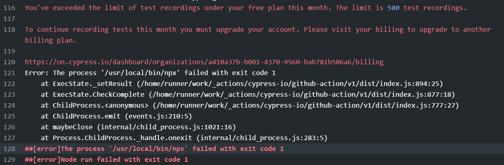

# cypress 并不最佳实践

## 安装和运行

直接 `yarn` 安装即可

```
yarn add cypress start-server-and-test -D
```

然后加入到 `npm script` 中, 运行 `yarn dev` 后开发服务器会运行，然后 `cypress` 窗口会打开

```json
{
  "scripts": {
	"start": "parcel index.html",
    "build": "parcel build index.html",
    "e2e": "cypress open",
    "dev": "start-server-and-test start http-get://localhost:1234 e2e"
  }
}
```

安装运行后，项目目录会多一个 `cypress` 文件夹

```
cypress
├── fixtures						// mock 数据文件
│   └── example.json
├── integration 					// 示例测试文件
│   └── examples
│       ├── actions.spec.js
│       ├── aliasing.spec.js
│       ├── assertions.spec.js
│       ├── ...	
├── plugins 						// 定义一些初始化设置跟变量
│   └── index.js
└── support							// 可以抽取一些公共的方法作为我们的私有命令
    ├── commands.js
    └── index.js
```

## 一些注意点

- 免费账户好像每月只有 500 个 test recordings 额度
